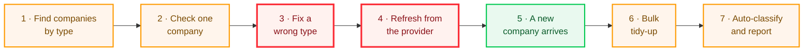

# 2 · Journey health map

> part of [0.01 · Define & maintain company type](README.md)

**For: COO + CPO.** _The flow as a person walks it. Plain words — read this aloud in standup._

> **Takeaway:** the Corporate bucket lies from step 1 — banks and advisories sit in it by definition — and the moment someone tries to correct or protect a type, the journey dead-ends or fails without telling anyone.

## The seven steps

_Two of the seven fail without telling anyone — steps 3 and 4, outlined in red. Nothing on the path warns the person walking it._



#### Find companies by type

<mark style="color:$warning;background-color:$warning;">DEGRADED</mark> &nbsp; <mark style="color:$danger;background-color:$danger;">P13</mark> <mark style="background-color:$info;">P8</mark>

Filtering is fast and exact — but the Corporate bucket itself over-includes: banks and advisories sit in the client list.



#### Check one company

<mark style="color:$warning;background-color:$warning;">DEGRADED</mark> &nbsp; <mark style="background-color:$info;">P7</mark>

Open the panel; read type badges, parent and sponsor links.



#### Fix a wrong type

<mark style="color:$danger;background-color:$danger;">**SILENT-FAIL**</mark> &nbsp; <mark style="color:$danger;background-color:$danger;">P1</mark>

While reviewing, the steward spots a mis-tagged firm — there is nowhere to correct it; the bad tag stays.



#### Refresh from the provider

<mark style="color:$danger;background-color:$danger;">**SILENT-FAIL**</mark> &nbsp; <mark style="color:orange;background-color:orange;">P3</mark> <mark style="color:$warning;background-color:$warning;">P2</mark>

Scheduled refreshes rewrite every type value with no warning; the manual refresh button never made it onto the page.



#### A new company arrives

<mark style="color:$success;background-color:$success;">OK</mark>

A sign-up creates a company with no type — accepted behaviour (2026-08-11); it gains a type on the next provider import.



#### Bulk tidy-up

<mark style="color:$warning;background-color:$warning;">DEGRADED</mark> &nbsp; <mark style="color:$warning;background-color:$warning;">P6</mark> <mark style="color:$warning;background-color:$warning;">P9</mark> <mark style="background-color:$info;">P12</mark>

Admins segment with buckets/labels instead; edits apply but leave no record of who changed what.



#### Auto-classify & report

<mark style="color:$warning;background-color:$warning;">DEGRADED</mark> &nbsp; <mark style="color:orange;background-color:orange;">P5</mark> <mark style="color:$warning;background-color:$warning;">P11</mark>

The automated classifier tags companies, but low-confidence results hide in logs and four "type" vocabularies disagree in reports.



_P13 is created by step 4's re-derivation but felt at step 1; P10 (one-sided validation of the lifecycle field) sits beside the flow on step 2's edit panel._

## Scenarios

<mark style="color:$success;background-color:$success;">CONFIRMED</mark> _in rev 4; CPO may still trim before §5 expansion. One happy path + six variants the code can actually produce, worst first by provisional score._

| #      | Scenario                                                  | Trigger                                                                                                                                                                                                                                | Persona               |               Σ RPN |
| ------ | --------------------------------------------------------- | -------------------------------------------------------------------------------------------------------------------------------------------------------------------------------------------------------------------------------------- | --------------------- | ------------------: |
| **S3** | Provider refresh re-derives type                          | A provider refresh (today only the scheduled kind — the manual button is disconnected) rewrites all three type values; "Corporate" is recorded as "not sponsor, not portfolio" — sweeping banks and advisories into the client bucket. | Data steward / system | **134** · P13+P3+P2 |
| **S4** | Correct a misclassified company _(dead end)_              | While reviewing, a steward spots a PE firm tagged Corporate and tries to fix it — there is nowhere to do so; the wrong tag stays.                                                                                                      | RevOps data steward   |         **60** · P1 |
| **S5** | Bulk segment selected companies                           | An admin selects rows and bulk-assigns buckets/labels — the workaround taxonomy; the edit applies instantly but leaves no record of who changed what.                                                                                  | RevOps admin          |      **46** · P6+P9 |
| **S7** | Automated classification backfill                         | An engineer runs the automated classifier over all companies; results are written safely and repeatably, but low-confidence calls surface only in logs.                                                                                | Platform engineer     |        **16** · P11 |
| **S2** | Verify one company's classification                       | Click a row → company panel: type badges, parent / sponsor links, beta classifications; a deleted or merged company shows an empty panel with no explanation.                                                                          | RevOps data steward   |         **12** · P7 |
| **S1** | Type-filtered prospecting list _(main success scenario)_  | Open the companies list, filter to Sponsors excluding Corporates, page through the results and read the exact count. Counts are exact — but the Corporate bucket itself over-includes (P13, scored under S3).                          | SDR                   |         **10** · P8 |
| **S6** | Bulk "all matching" with count guard _(race / rejection)_ | An admin applies a bulk edit to "everything matching this filter"; the system rejects it because the matching set changed meanwhile — correct behaviour, but the message offers no way forward.                                        | RevOps admin          |         **8** · P12 |

## Symptom check

_Answers the COO's [§0](decision-strip.md) row by looking, not memory. Support can forward this as-is._

| What a user would report                                          | Who hits it                                                                | Workaround today                                                                                            |
| ----------------------------------------------------------------- | -------------------------------------------------------------------------- | ----------------------------------------------------------------------------------------------------------- |
| _"My Corporate list is full of banks and M\&A advisories."_ <mark style="color:$danger;background-color:$danger;">P13</mark> | Anyone targeting or reporting from the Corporate filter (SDRs, leadership) | Cross-check each company's industry (shown on the company panel; industry filters exist) and prune by hand. |
| _"This company has the wrong type and I can't change it."_ <mark style="color:$danger;background-color:$danger;">P1</mark>   | Data stewards reviewing records                                            | None in the product — note it elsewhere; the wrong tag stays.                                               |
